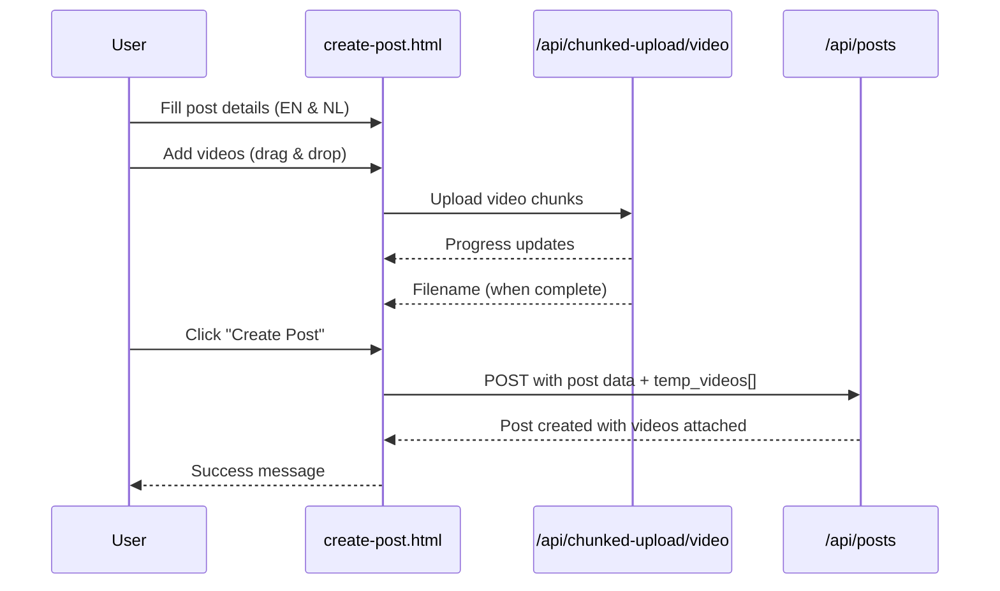
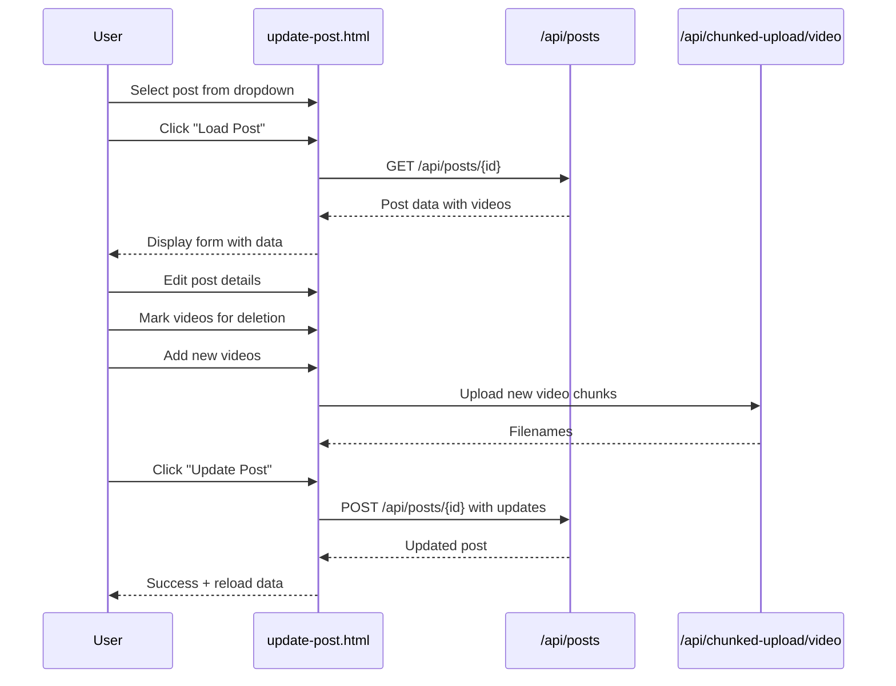

# Post Management with Chunked Video Upload - Complete Guide

## 🎯 Overview

Two premium HTML pages for complete post management with chunked video upload support:

1. **create-post.html** - Create new posts with videos
2. **update-post.html** - Update existing posts and manage videos

Both pages use your existing API endpoints with chunked video upload integration.

---

## 📄 Page 1: Create Post

**URL**: `http://localhost:8000/create-post.html`

### Features

✅ **Multilingual Support**
- Title fields for English (EN) and Dutch (NL)
- Body fields for English (EN) and Dutch (NL)

✅ **Chunked Video Upload**
- Drag & drop multiple videos
- 1 MB chunks for reliable upload
- Real-time progress tracking
- Resume capability

✅ **User Experience**
- Premium gradient design
- Smooth animations
- Real-time validation
- Success/error feedback

### Workflow



### How to Use

1. **Open Page**: Navigate to `http://localhost:8000/create-post.html`

2. **Fill Post Details**:
   - Title (EN): English title
   - Title (NL): Dutch title  
   - Body (EN): English content
   - Body (NL): Dutch content

3. **Add Videos** (Optional):
   - Drag & drop videos onto upload area
   - OR click upload area to browse
   - Watch upload progress for each video
   - Videos upload automatically when added

4. **Create Post**:
   - Click "Create Post" button
   - System waits for any pending uploads
   - Post is created with all videos attached
   - Redirects to post view on success

---

## ✏️ Page 2: Update Post

**URL**: `http://localhost:8000/update-post.html`

### Features

✅ **Post Selection**
- Dropdown with all existing posts
- Load button to fetch post data

✅ **Existing Video Management**
- Grid display of current videos
- Video preview thumbnails
- Click × to mark for deletion
- Visual feedback for marked videos

✅ **Add New Videos**
- Same chunked upload as create page
- Add multiple new videos
- Real-time progress tracking

✅ **Full Update Control**
- Edit title and body (both languages)
- Delete existing videos
- Add new videos
- All in one operation

### Workflow



### How to Use

1. **Open Page**: Navigate to `http://localhost:8000/update-post.html`

2. **Select Post**:
   - Choose post from dropdown
   - Click "Load Post" button
   - Wait for post data to load

3. **Edit Post Details**:
   - Modify title (EN/NL)
   - Modify body (EN/NL)

4. **Manage Existing Videos**:
   - View all current videos in grid
   - Click × button to mark for deletion
   - Marked videos show grayed out
   - Click × again to unmark

5. **Add New Videos** (Optional):
   - Drag & drop new videos
   - Watch upload progress
   - Videos upload automatically

6. **Save Changes**:
   - Click "Update Post" button
   - System processes all changes
   - Page reloads with updated data

---

## 🔧 Technical Implementation

### Backend Changes

#### PostController.php

Added support for `temp_videos` parameter in both `store()` and `update()` methods:

```php
// Handle temporary videos from chunked upload
if ($request->has('temp_videos')) {
    $tempVideos = $request->input('temp_videos');
    if (is_array($tempVideos)) {
        foreach ($tempVideos as $filename) {
            $tempPath = storage_path('app/public/temp-videos/' . $filename);
            if (file_exists($tempPath)) {
                $post->addMedia($tempPath)
                    ->toMediaCollection('video_gallery');
                @unlink($tempPath); // Clean up temp file
            }
        }
    }
}
```

#### PostRequest.php

Added validation rules:

```php
'temp_videos' => 'nullable|array',
'temp_videos.*' => 'string',
```

### Frontend Implementation

Both pages use:
- **Resumable.js** for chunked uploads
- **FormData** for multipart form submission
- **Fetch API** for HTTP requests
- **Vanilla JavaScript** (no dependencies except Resumable.js)

### Data Flow

**Create Post**:
1. Videos upload to `/api/chunked-upload/video` → temp storage
2. Collect all temp filenames
3. Submit form to `/api/posts` with `temp_videos[]` array
4. Backend moves videos from temp to media library
5. Temp files deleted automatically

**Update Post**:
1. Load existing post data
2. Upload new videos to temp storage
3. Collect video IDs to delete
4. Submit to `/api/posts/{id}` with:
   - Updated post data
   - `delete_video_gallery_ids[]` array
   - `temp_videos[]` array
5. Backend processes all changes atomically

---

## 📋 API Endpoints Used

### Create Post
```
POST /api/posts
Content-Type: multipart/form-data

Parameters:
- title[en]: string
- title[nl]: string
- body[en]: string
- body[nl]: string
- temp_videos[]: array of filenames (optional)
```

### Update Post
```
POST /api/posts/{id}
Content-Type: multipart/form-data

Parameters:
- title[en]: string
- title[nl]: string
- body[en]: string
- body[nl]: string
- delete_video_gallery_ids[]: array of media IDs (optional)
- temp_videos[]: array of filenames (optional)
```

### Chunked Upload
```
POST /api/chunked-upload/video
Content-Type: multipart/form-data

Returns: { filename: "video_123.mp4", ... }
```

---

## 🎨 Design Features

### Visual Elements
- **Gradient Background**: Purple to violet
- **Glassmorphism**: Frosted glass effect on container
- **Smooth Animations**: Slide-up, fade-in effects
- **Progress Bars**: Animated with shimmer effect
- **Color Coding**: 
  - Purple: Active/uploading
  - Green: Complete
  - Red: Error/delete

### Responsive Design
- Mobile-friendly layout
- Grid adapts to screen size
- Touch-friendly buttons
- Optimized for all devices

---

## ✅ Testing Checklist

### Create Post Page

- [ ] Open `http://localhost:8000/create-post.html`
- [ ] Fill in all form fields (EN & NL)
- [ ] Add single video via drag & drop
- [ ] Verify progress tracking works
- [ ] Create post without videos
- [ ] Create post with multiple videos
- [ ] Verify post appears in API
- [ ] Check videos are attached correctly

### Update Post Page

- [ ] Open `http://localhost:8000/update-post.html`
- [ ] Select post from dropdown
- [ ] Load post data successfully
- [ ] Edit title and body
- [ ] Mark existing video for deletion
- [ ] Unmark video (click × again)
- [ ] Add new video
- [ ] Update post with all changes
- [ ] Verify changes in API
- [ ] Check deleted videos are removed
- [ ] Check new videos are added

---

## 🚀 Quick Start

### Create a New Post

```bash
# 1. Open browser
http://localhost:8000/create-post.html

# 2. Fill form
Title (EN): "My First Post"
Title (NL): "Mijn Eerste Bericht"
Body (EN): "This is my first post with videos"
Body (NL): "Dit is mijn eerste bericht met video's"

# 3. Add videos (drag & drop)
# 4. Click "Create Post"
# 5. Done! ✓
```

### Update an Existing Post

```bash
# 1. Open browser
http://localhost:8000/update-post.html

# 2. Select post from dropdown
# 3. Click "Load Post"
# 4. Make changes
# 5. Click "Update Post"
# 6. Done! ✓
```

---

## 🔍 Troubleshooting

**Issue**: Videos not uploading  
**Fix**: Check Laravel server is running and chunked upload routes are registered

**Issue**: Post created but videos missing  
**Fix**: Verify `temp-videos` directory exists in `storage/app/public/`

**Issue**: "File size greater than maximum"  
**Fix**: Already fixed! Config set to 500MB in `config/media-library.php`

**Issue**: Form fields not populating on update  
**Fix**: Ensure post has translatable title/body in both EN and NL

**Issue**: Deleted videos still showing  
**Fix**: Reload the post after update to see current state

---

## 📦 Files Created/Modified

### New Files
- `public/create-post.html` - Create post page
- `public/update-post.html` - Update post page

### Modified Files
- `app/Http/Controllers/Api/PostController.php` - Added temp_videos support
- `app/Http/Requests/PostRequest.php` - Added temp_videos validation

### Existing Files Used
- `routes/api.php` - Uses existing routes
- `app/Models/Post.php` - Uses existing model
- `config/media-library.php` - Already configured for large files

---

## 🎯 Summary

✅ **Two complete HTML pages** for post management  
✅ **Chunked video upload** integrated seamlessly  
✅ **Multilingual support** (EN & NL)  
✅ **Premium design** with smooth UX  
✅ **Existing API endpoints** - no new routes needed  
✅ **Full CRUD operations** with video management  
✅ **Production-ready** code with error handling  

**Ready to use!** Just open the pages in your browser and start creating/updating posts with videos! 🚀
